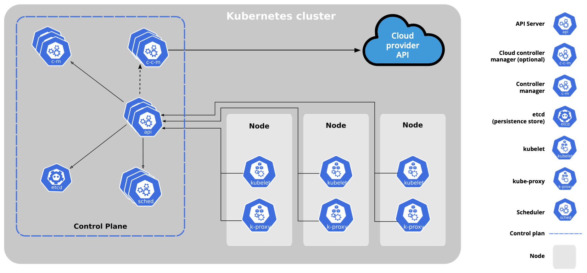
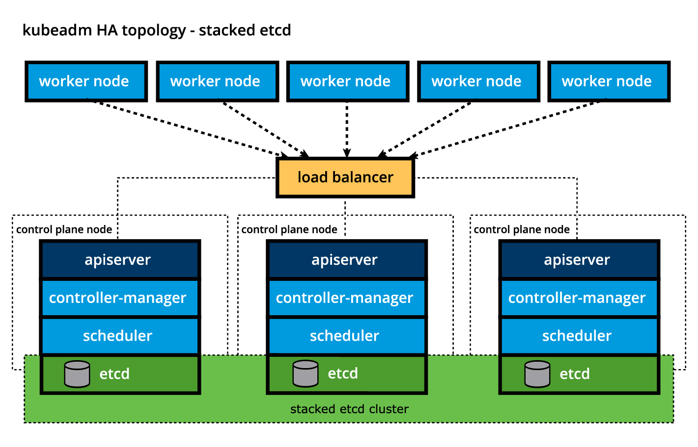
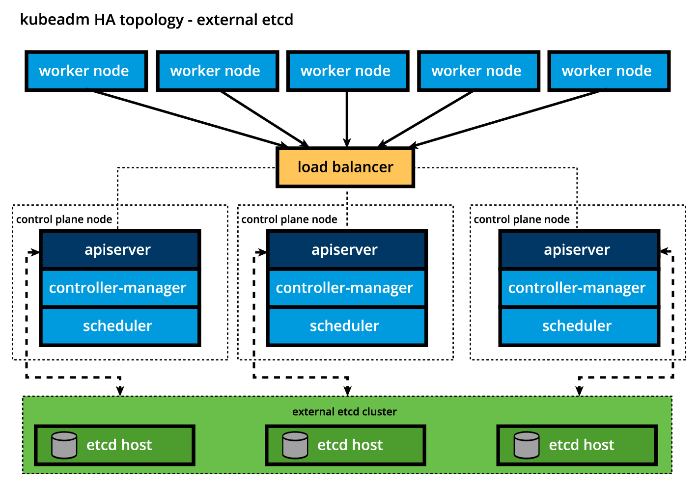
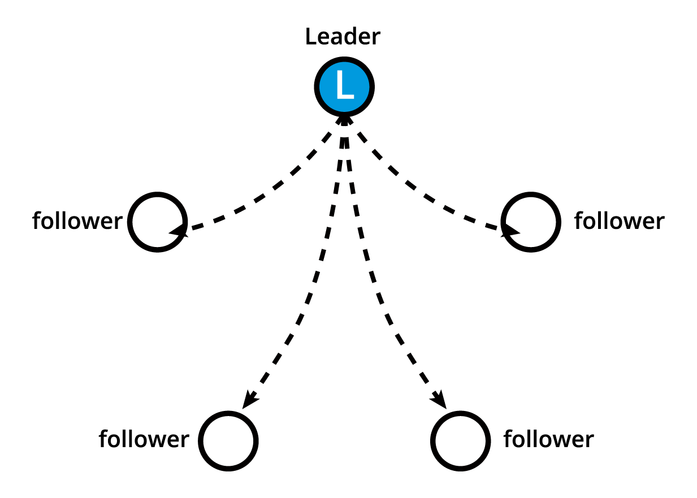
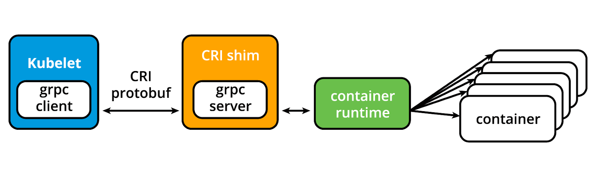
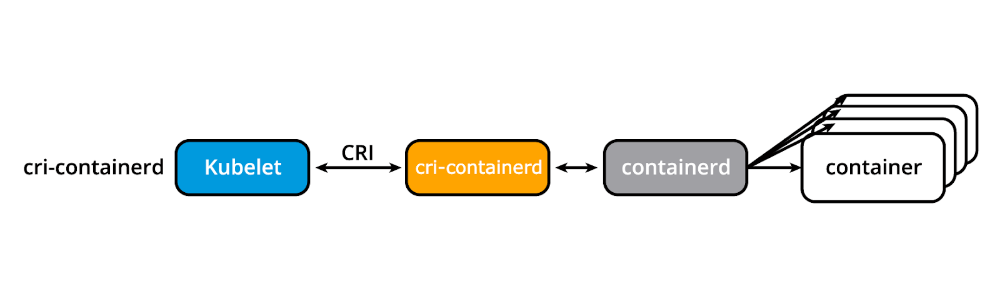
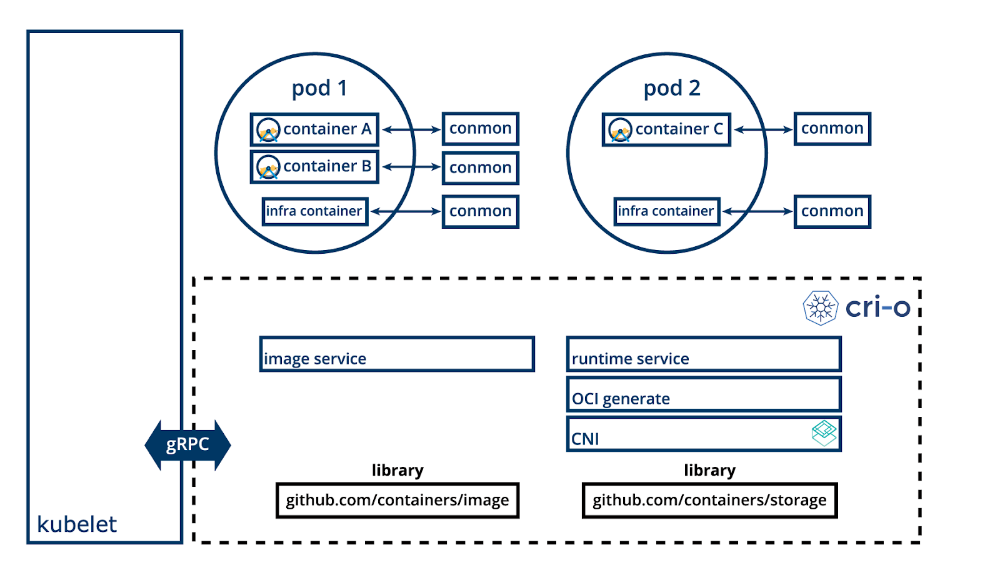
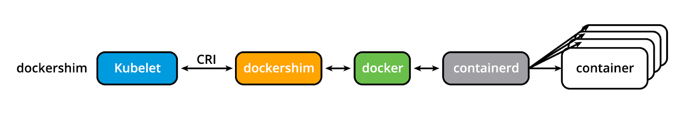
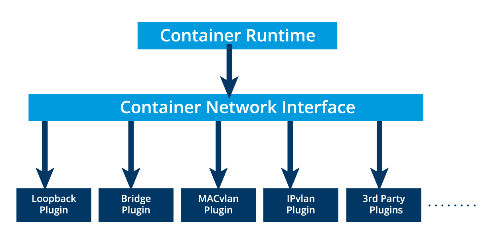

## Understand Microservice concept

Microservices can be deployed individually on separate servers provisioned with fewer resources - only what is required by each service and the host system itself, helping to lower compute resource expenses.

Microservices-based architecture is aligned with Event-driven Architecture and Service-Oriented Architecture (SOA) principles, where complex applications are composed of small independent processes which communicate with each other through Application Programming Interfaces (APIs) over a network. APIs allow access by other internal services of the same application or external, third-party services and applications.

## Container Orchestration

 The container runtimes like runC, containerd, or cri-o can use pre-packaged images as a source to create and run one or more containers
These runtimes are capable of running containers on a single host, however, in practice, we would like to have a fault-tolerant and scalable solution, achieved by building a single controller/management unit, a collection of multiple hosts connected together. This controller/management unit is generally referred to as a container orchestrator.

### Concepts
Containers are an application-centric method to deliver high-performing, scalable applications on any infrastructure of your choice. Containers are best suited to deliver microservices by providing portable, isolated virtual environments for applications to run without interference from other running applications.

Microservices are lightweight applications written in various modern programming languages, with specific dependencies, libraries and environmental requirements. To ensure that an application has everything it needs to run successfully it is packaged together with its dependencies.

Containers encapsulate microservices and their dependencies but do not run them directly. Containers run container images.

A container image bundles the application along with its runtime, libraries, and dependencies, and it represents the source of a container deployed to offer an isolated executable environment for the application. Containers can be deployed from a specific image on many platforms, such as workstations, Virtual Machines, public cloud, etc.

Container orchestrators are tools which group systems together to form clusters where containers' deployment and management is automated at scale while meeting the requirements mentioned above.   

## Kubernetes

According to the Kubernetes website,

"Kubernetes is an open-source system for automating deployment, scaling, and management of containerized applications".

Kubernetes comes from the Greek word κυβερνήτης, which means helmsman or ship pilot. With this analogy in mind, we can think of Kubernetes as the pilot on a ship of containers.

Kubernetes is also referred to as k8s (pronounced Kate's), as there are 8 characters between k and s.

Kubernetes is highly inspired by the Google Borg system, a container and workload orchestrator for its global operations for more than a decade. It is an open source project written in the Go language and licensed under the Apache License, Version 2.0.

Kubernetes was started by Google and, with its v1.0 release in July 2015, Google donated it to the Cloud Native Computing Foundation (CNCF), one of the largest sub-foundations of the Linux Foundation.

### From Borg to Kubernetes

According to the abstract of Google's Borg paper, published in 2015, 
https://research.google/pubs/pub43438/

"Google's Borg system is a cluster manager that runs hundreds of thousands of jobs, from many thousands of different applications, across a number of clusters each with up to tens of thousands of machines".

For more than a decade, Borg has been Google's secret, running its worldwide containerized workloads in production. Services we use from Google, such as Gmail, Drive, Maps, Docs, etc., are all serviced using Borg. 

### Kubernetes Features

Kubernetes offers a very rich set of features for container orchestration. Some of its fully supported features are:

- Automatic bin packing
Kubernetes automatically schedules containers based on resource needs and constraints, to maximize utilization without sacrificing availability.

- Designed for extensibility
A Kubernetes cluster can be extended with new custom features without modifying the upstream source code.

- Self-healing
Kubernetes automatically replaces and reschedules containers from failed nodes. It terminates and then restarts containers that become unresponsive to health checks, based on existing rules/policy. It also prevents traffic from being routed to unresponsive containers.

- Horizontal scaling
With Kubernetes applications are scaled manually or automatically based on CPU or custom metrics utilization.

- Service discovery and load balancing
Containers receive IP addresses from Kubernetes, while it assigns a single Domain Name System (DNS) name to a set of containers to aid in load-balancing requests across the containers of the set.

Additional fully supported Kubernetes features are:

- Automated rollouts and rollbacks
Kubernetes seamlessly rolls out and rolls back application updates and configuration changes, constantly monitoring the application's health to prevent any downtime.

- Secret and configuration management
Kubernetes manages sensitive data and configuration details for an application separately from the container image, in order to avoid a rebuild of the respective image. Secrets consist of sensitive/confidential information passed to the application without revealing the sensitive content to the stack configuration, like on GitHub.

- Storage orchestration
Kubernetes automatically mounts software-defined storage (SDS) solutions to containers from local storage, external cloud providers, distributed storage, or network storage systems.

- Batch execution
Kubernetes supports batch execution, long-running jobs, and replaces failed containers.

- IPv4/IPv6 dual-stack
Kubernetes supports both IPv4 and IPv6 addresses.

## Kubernetes Architecture

### Control Plane Node Overview

The control plane node provides a running environment for the control plane agents responsible for managing the state of a Kubernetes cluster, and it is the brain behind all operations inside the cluster. The control plane components are agents with very distinct roles in the cluster's management. In order to communicate with the Kubernetes cluster, users send requests to the control plane via a Command Line Interface (CLI) tool, a Web User-Interface (Web UI) Dashboard, or an Application Programming Interface (API).

It is important to keep the control plane running at all costs. Losing the control plane may introduce downtime, causing service disruption to clients, with possible loss of business. To ensure the control plane's fault tolerance, control plane node replicas can be added to the cluster, configured in High-Availability (HA) mode. While only one of the control plane nodes is dedicated to actively managing the cluster, the control plane components stay in sync across the control plane node replicas. This type of configuration adds resiliency to the cluster's control plane, should the active control plane node fail.

To persist the Kubernetes cluster's state, all cluster configuration data is saved to a distributed key-value store which only holds cluster state related data, no client workload generated data. The key-value store may be configured on the control plane node (stacked topology), or on its dedicated host (external topology) to help reduce the chances of data store loss by decoupling it from the other control plane agents.

In the stacked key-value store topology, HA control plane node replicas ensure the key-value store's resiliency as well. However, that is not the case with external key-value store topology, where the dedicated key-value store hosts have to be separately replicated for HA, a configuration that introduces the need for additional hardware, hence additional operational costs.

A control plane node runs the following essential control plane components and agents:

API Server
Scheduler
Controller Managers
Key-Value Data Store.
In addition, the control plane node runs:

Container Runtime
Node Agent
Proxy
Optional add-ons for cluster-level monitoring and logging.

#### Control Plane Node Components: API Server

All the administrative tasks are coordinated by the kube-apiserver, a central control plane component running on the control plane node. The API Server intercepts RESTful calls from users, administrators, developers, operators and external agents, then validates and processes them. During processing the API Server reads the Kubernetes cluster's current state from the key-value store, and after a call's execution, the resulting state of the Kubernetes cluster is saved in the key-value store for persistence. The API Server is the only control plane component to talk to the key-value store, both to read from and to save Kubernetes cluster state information - acting as a middle interface for any other control plane agent inquiring about the cluster's state.

The API Server is highly configurable and customizable. It can scale horizontally, but it also supports the addition of custom secondary API Servers, a configuration that transforms the primary API Server into a proxy to all secondary, custom API Servers, routing all incoming RESTful calls to them based on custom defined rules.

#### Control Plane Node Components: Scheduler

The role of the kube-scheduler is to assign new workload objects, such as pods encapsulating containers, to nodes - typically worker nodes. During the scheduling process, decisions are made based on current Kubernetes cluster state and new workload object's requirements. The scheduler obtains from the key-value store, via the API Server, resource usage data for each worker node in the cluster. The scheduler also receives from the API Server the new workload object's requirements which are part of its configuration data. Requirements may include constraints that users and operators set, such as scheduling work on a node labeled with disk==ssd key-value pair. The scheduler also takes into account Quality of Service (QoS) requirements, data locality, affinity, anti-affinity, taints, toleration, cluster topology, etc. Once all the cluster data is available, the scheduling algorithm filters the nodes with predicates to isolate the possible node candidates which then are scored with priorities in order to select the one node that satisfies all the requirements for hosting the new workload. The outcome of the decision process is communicated back to the API Server, which then delegates the workload deployment with other control plane agents.

The scheduler is highly configurable and customizable through scheduling policies, plugins, and profiles. Additional custom schedulers are also supported, then the object's configuration data should include the name of the custom scheduler expected to make the scheduling decision for that particular object; if no such data is included, the default scheduler is selected instead.

A scheduler is extremely important and complex in a multi-node Kubernetes cluster, while in a single-node Kubernetes cluster possibly used for learning and development purposes, the scheduler's job is quite simple.

#### Control Plane Node Components: Controller Managers

The controller managers are components of the control plane node running controllers or operator processes to regulate the state of the Kubernetes cluster. Controllers are watch-loop processes continuously running and comparing the cluster's desired state (provided by objects' configuration data) with its current state (obtained from the key-value store via the API Server). In case of a mismatch, corrective action is taken in the cluster until its current state matches the desired state.

The kube-controller-manager runs controllers or operators responsible to act when nodes become unavailable, to ensure container pod counts are as expected, to create endpoints, service accounts, and API access tokens.

The cloud-controller-manager runs controllers or operators responsible to interact with the underlying infrastructure of a cloud provider when nodes become unavailable, to manage storage volumes when provided by a cloud service, and to manage load balancing and routing.

#### Control Plane Node Components: Key-Value Data Store

etcd is an open source project under the Cloud Native Computing Foundation (CNCF). etcd is a strongly consistent, distributed key-value data store used to persist a Kubernetes cluster's state. New data is written to the data store only by appending to it, data is never replaced in the data store. Obsolete data is compacted (or shredded) periodically to minimize the size of the data store.

Out of all the control plane components, only the API Server is able to communicate with the etcd data store.

etcd's CLI management tool - etcdctl, provides snapshot save and restore capabilities which come in handy especially for a single etcd instance Kubernetes cluster - common in Development and learning environments. However, in Stage and Production environments, it is extremely important to replicate the data stores in HA mode, for cluster configuration data resiliency.

Some Kubernetes cluster bootstrapping tools, such as kubeadm, by default, provision stacked etcd control plane nodes, where the data store runs alongside and shares resources with the other control plane components on the same control plane node.

For data store isolation from the control plane components, the bootstrapping process can be configured for an external etcd topology, where the data store is provisioned on a dedicated separate host, thus reducing the chances of an etcd failure.

Both stacked and external etcd topologies support HA configurations. etcd is based on the Raft Consensus Algorithm (see https://web.stanford.edu/~ouster/cgi-bin/papers/raft-atc14) which allows a collection of machines to work as a coherent group that can survive the failures of some of its members. At any given time, one of the nodes in the group will be the leader, and the rest of them will be the followers. etcd gracefully handles leader elections and can tolerate node failure, including leader node failures. Any node can be treated as a leader. 

etcd is written in the Go programming language. In Kubernetes, besides storing the cluster state, etcd is also used to store configuration details such as subnets, ConfigMaps, Secrets, etc.

### Worker Node Overview

A worker node has the following components:

Container Runtime
Node Agent - kubelet
Proxy - kube-proxy
Add-ons for DNS, Dashboard user interface, cluster-level monitoring and logging.

#### Worker Node Components: Container Runtime

Although Kubernetes is described as a "container orchestration engine", it lacks the capability to directly handle and run containers. In order to manage a container's lifecycle, Kubernetes requires a container runtime on the node where a Pod and its containers are to be scheduled. Runtimes are required on all nodes of a Kubernetes cluster, both control plane and worker. 

#### Worker Node Components: Node Agent - kubelet

The kubelet is an agent running on each node, control plane and workers, and communicates with the control plane. It receives Pod definitions, primarily from the API Server, and interacts with the container runtime on the node to run containers associated with the Pod. It also monitors the health and resources of Pods running containers.

The kubelet connects to container runtimes through a plugin based interface - the Container Runtime Interface (CRI). The CRI consists of protocol buffers, gRPC API, libraries, and additional specifications and tools. In order to connect to interchangeable container runtimes, kubelet uses a CRI shim, an application which provides a clear abstraction layer between kubelet and the container runtime. 

(see http://blog.kubernetes.io/2016/12/container-runtime-interface-cri-in-kubernetes.html)

As shown above, the kubelet acting as grpc client connects to the CRI shim acting as grpc server to perform container and image operations. The CRI implements two services: ImageService and RuntimeService. The ImageService is responsible for all the image-related operations, while the RuntimeService is responsible for all the Pod and container-related operations.

#### Worker Node Components: kubelet - CRI shims

Originally the kubelet agent supported only a couple of container runtimes, first the Docker Engine followed by rkt, through a unique interface model integrated directly in the kubelet source code. However, this approach was not intended to last forever even though it was especially beneficial for Docker. In time, Kubernetes started migrating towards a standardized approach to container runtime integration by introducing the CRI. Kubernetes adopted a decoupled and flexible method to integrate with various container runtimes without the need to recompile its source code. Any container runtime that implements the CRI could be used by Kubernetes to manage containers.

Shims are Container Runtime Interface (CRI) implementations, interfaces or adapters, specific to each container runtime supported by Kubernetes. Below we present some examples of CRI shims:

- cri-containerd
cri-containerd allows containers to be directly created and managed with containerd at kubelet's request:

see http://blog.kubernetes.io/2017/11/containerd-container-runtime-options-kubernetes.html

- CRI-O
CRI-O enables the use of any Open Container Initiative (OCI) compatible runtime with Kubernetes, such as runC:

see http://cri-o.io/

- dockershim and cri-dockerd
Before Kubernetes release v1.24 the dockershim allowed containers to be created and managed by invoking the Docker Engine and its internal runtime containerd. Due to Docker Engine's popularity, this shim has been the default interface used by kubelet. However, starting with Kubernetes release v1.24, the dockershim is no longer being maintained by the Kubernetes project, its specific code is removed from kubelet source code, thus will no longer be supported by the kubelet node agent of Kubernetes. As a result, Docker, Inc., and Mirantis have agreed to introduce and maintain a replacement adapter, cri-dockerd that would ensure that the Docker Engine will continue to be a container runtime option for Kubernetes, in addition to the Mirantis Container Runtime (MCR). The introduction of cri-dockerd also ensures that both Docker Engine and MCR follow the same standardized integration method as the CRI-compatible runtimes.

See http://blog.kubernetes.io/2017/11/containerd-container-runtime-options-kubernetes.html

#### Worker Node Components: Proxy - kube-proxy

The kube-proxy is the network agent which runs on each node, control plane and workers, responsible for dynamic updates and maintenance of all networking rules on the node. It abstracts the details of Pods networking and forwards connection requests to the containers in the Pods. 

The kube-proxy is responsible for TCP, UDP, and SCTP stream forwarding or random forwarding across a set of Pod backends of an application, and it implements forwarding rules defined by users through Service API objects.

#### Worker Node Components: Add-ons

Add-ons are cluster features and functionality not yet available in Kubernetes, therefore implemented through 3rd-party pods and services.

- DNS
Cluster DNS is a DNS server required to assign DNS records to Kubernetes objects and resources.
- Dashboard 
A general purpose web-based user interface for cluster management.
- Monitoring 
Collects cluster-level container metrics and saves them to a central data store.
- Logging 
Collects cluster-level container logs and saves them to a central log store for analysis.

### Networking Challenges

Decoupled microservices based applications rely heavily on networking in order to mimic the tight-coupling once available in the monolithic era. Networking, in general, is not the easiest to understand and implement. Kubernetes is no exception - as a containerized microservices orchestrator it needs to address a few distinct networking challenges:

- Container-to-Container communication inside Pods
- Pod-to-Pod communication on the same node and across cluster nodes
- Service-to-Pod communication within the same namespace and across cluster namespaces
- External-to-Service communication for clients to access applications in a cluster
All these networking challenges must be addressed before deploying a Kubernetes cluster.

#### Container-to-Container Communication Inside Pods
Making use of the underlying host operating system's kernel virtualization features, a container runtime creates an isolated network space for each container it starts. On Linux, this isolated network space is referred to as a network namespace. A network namespace can be shared across containers, or with the host operating system.

When a grouping of containers defined by a Pod is started, a special infrastructure Pause container is initialized by the Container Runtime for the sole purpose of creating a network namespace for the Pod. All additional containers, created through user requests, running inside the Pod will share the Pause container's network namespace so that they can all talk to each other via localhost.

#### Pod-to-Pod Communication Across Nodes

In a Kubernetes cluster Pods, groups of containers, are scheduled on nodes in a nearly unpredictable fashion. Regardless of their host node, Pods are expected to be able to communicate with all other Pods in the cluster, all this without the implementation of Network Address Translation (NAT). This is a fundamental requirement of any networking implementation in Kubernetes.

The Kubernetes network model aims to reduce complexity, and it treats Pods as VMs on a network, where each VM is equipped with a network interface - thus each Pod receiving a unique IP address. This model is called "IP-per-Pod" and ensures Pod-to-Pod communication, just as VMs are able to communicate with each other on the same network.

Let's not forget about containers though. They share the Pod's network namespace and must coordinate ports assignment inside the Pod just as applications would on a VM, all while being able to communicate with each other on localhost - inside the Pod. However, containers are integrated with the overall Kubernetes networking model through the use of the Container Network Interface (CNI) supported by CNI plugins. CNI is a set of specifications and libraries which allow plugins to configure the networking for containers. While there are a few core plugins, most CNI plugins are 3rd-party Software Defined Networking (SDN) solutions implementing the Kubernetes networking model. In addition to addressing the fundamental requirement of the networking model, some networking solutions offer support for Network Policies. Flannel, Weave, Calico are only a few of the SDN solutions available for Kubernetes clusters.

See:

Container Network Interface : https://github.com/containernetworking/cni
CNI plugins: https://github.com/containernetworking/cni#3rd-party-plugins
core plugins: https://github.com/containernetworking/plugins#plugins
Flannel: https://github.com/coreos/flannel/
Weave: https://www.weave.works/oss/net/
Calico: https://www.tigera.io/project-calico/

The container runtime offloads the IP assignment to CNI, which connects to the underlying configured plugin, such as Bridge or MACvlan, to get the IP address. Once the IP address is given by the respective plugin, CNI forwards it back to the requested container runtime. 

#### External-to-Pod Communication

A successfully deployed containerized application running in Pods inside a Kubernetes cluster may require accessibility from the outside world. Kubernetes enables external accessibility through Services, complex encapsulations of network routing rule definitions stored in iptables on cluster nodes and implemented by kube-proxy agents. By exposing services to the external world with the aid of kube-proxy, applications become accessible from outside the cluster over a virtual IP address and a dedicated port number.

## Installing Kubernetes

### Installing Production Clusters with Deployment Tools
When it comes to production ready solutions, there are several recommended tools for Kubernetes clusters bootstrapping and a few that are also capable of provisioning the necessary hosts on the underlying infrastructure.

Let's take a look at the most popular installation tools available:

- kubeadm
kubeadm is a first-class citizen of the Kubernetes ecosystem. It is a secure and recommended method to bootstrap a multi-node production ready Highly Available Kubernetes cluster, on-premises or in the cloud. kubeadm can also bootstrap a single-node cluster for learning. It has a set of building blocks to set up the cluster, but it is easily extendable to add more features. Please note that kubeadm does not support the provisioning of hosts - they should be provisioned separately with a tool of our choice.

- kubespray
kubespray (formerly known as kargo) allows us to install Highly Available production ready Kubernetes clusters on AWS, GCP, Azure, OpenStack, vSphere, or bare metal. kubespray is based on Ansible, and is available on most Linux distributions. It is a Kubernetes Incubator project.

- kops
kops enables us to create, upgrade, and maintain production-grade, Highly Available Kubernetes clusters from the command line. It can provision the required infrastructure as well. Currently, AWS is officially supported. Support for DigitalOcean and OpenStack is in beta, Azure and GCE is in alpha support, and other platforms are planned for the future. Explore the kops project for more details.

In addition, for a manual installation approach, the Kubernetes The Hard Way GitHub project by Kelsey Hightower is an extremely helpful installation guide and resource. The project aims to teach all the detailed steps involved in the bootstrapping of a Kubernetes cluster, steps that are otherwise automated by various tools mentioned in this chapter and obscured from the end user.